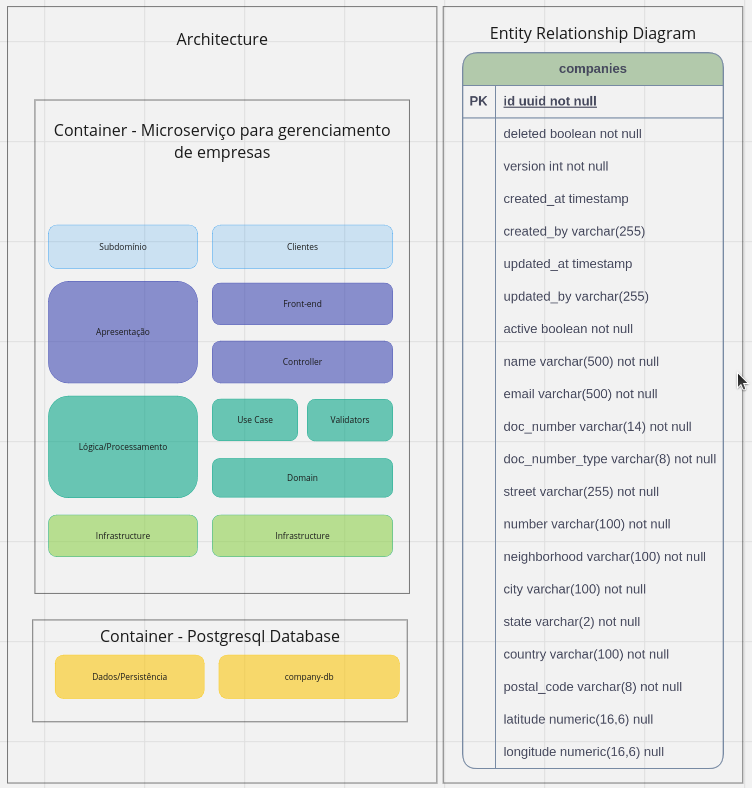
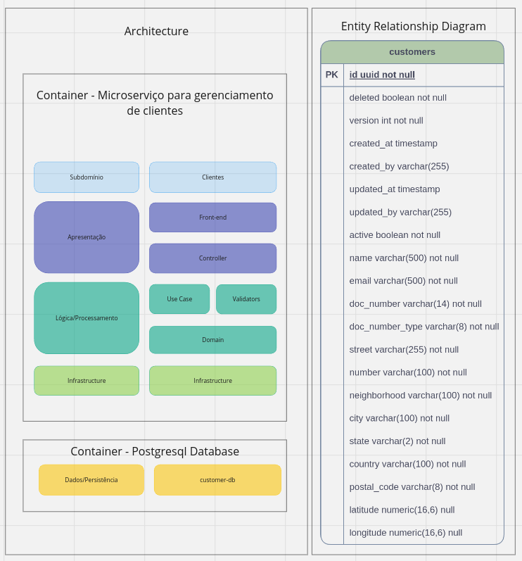
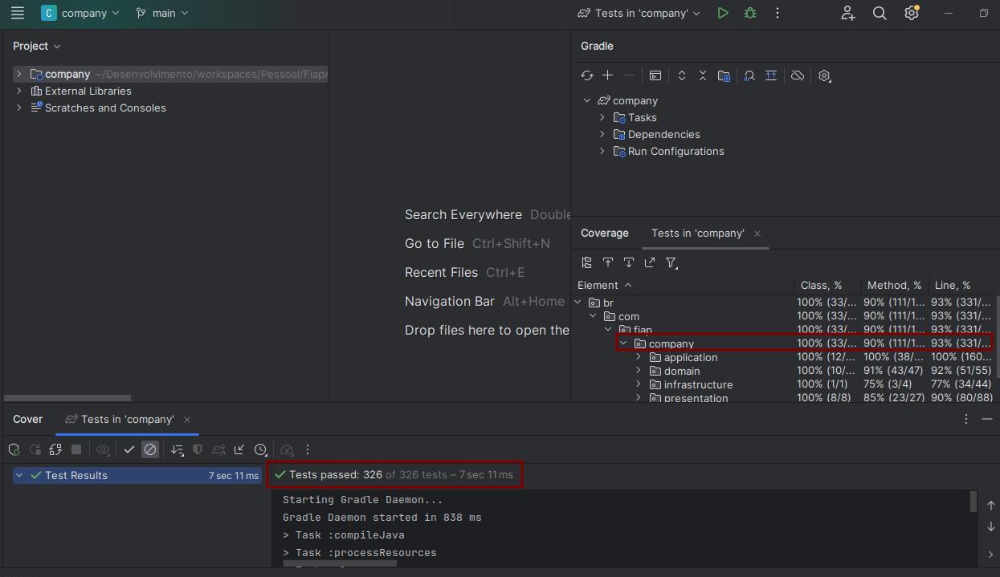
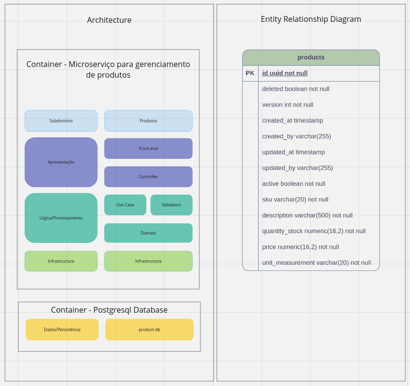
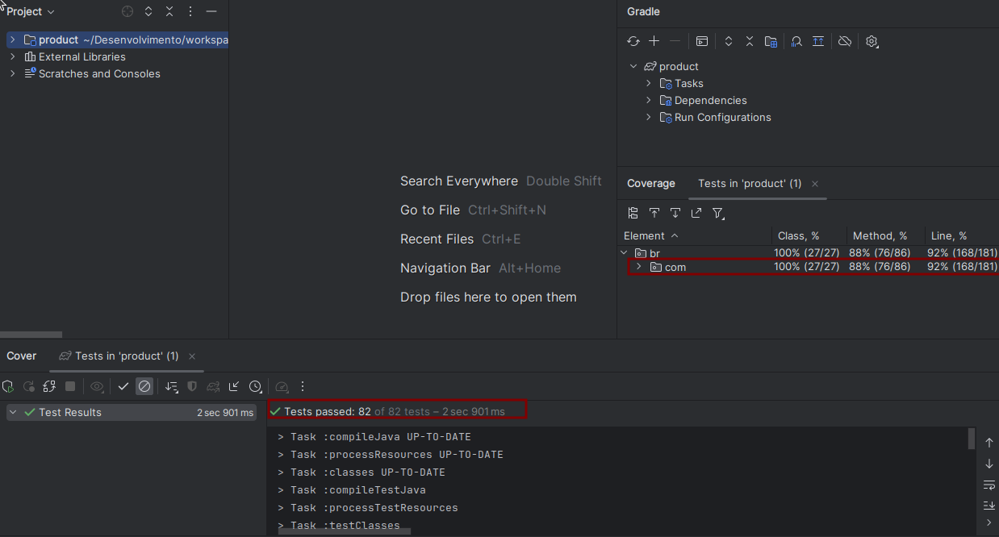
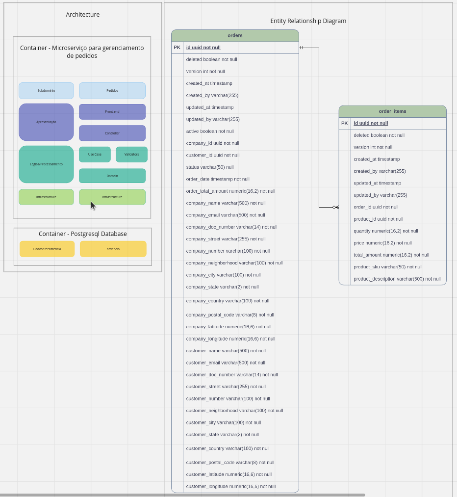
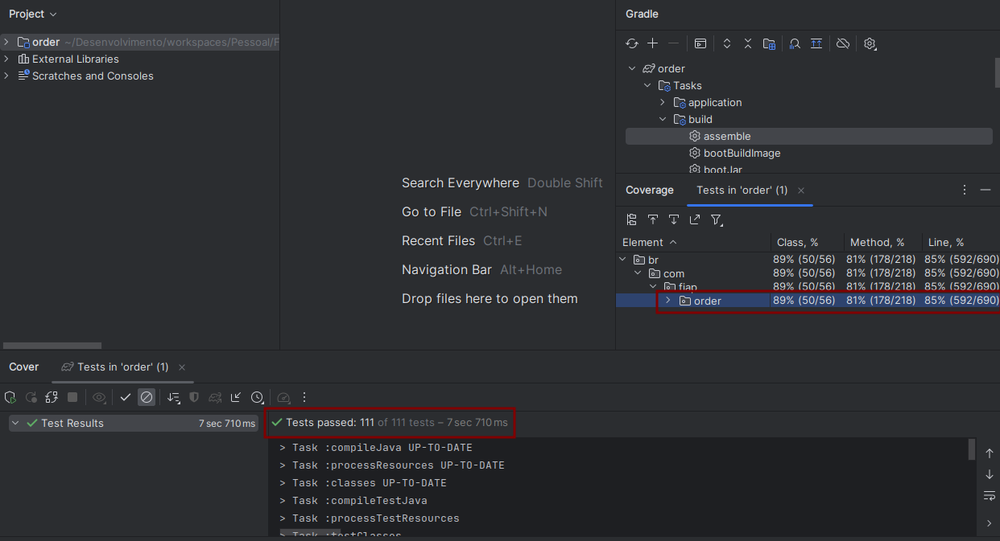
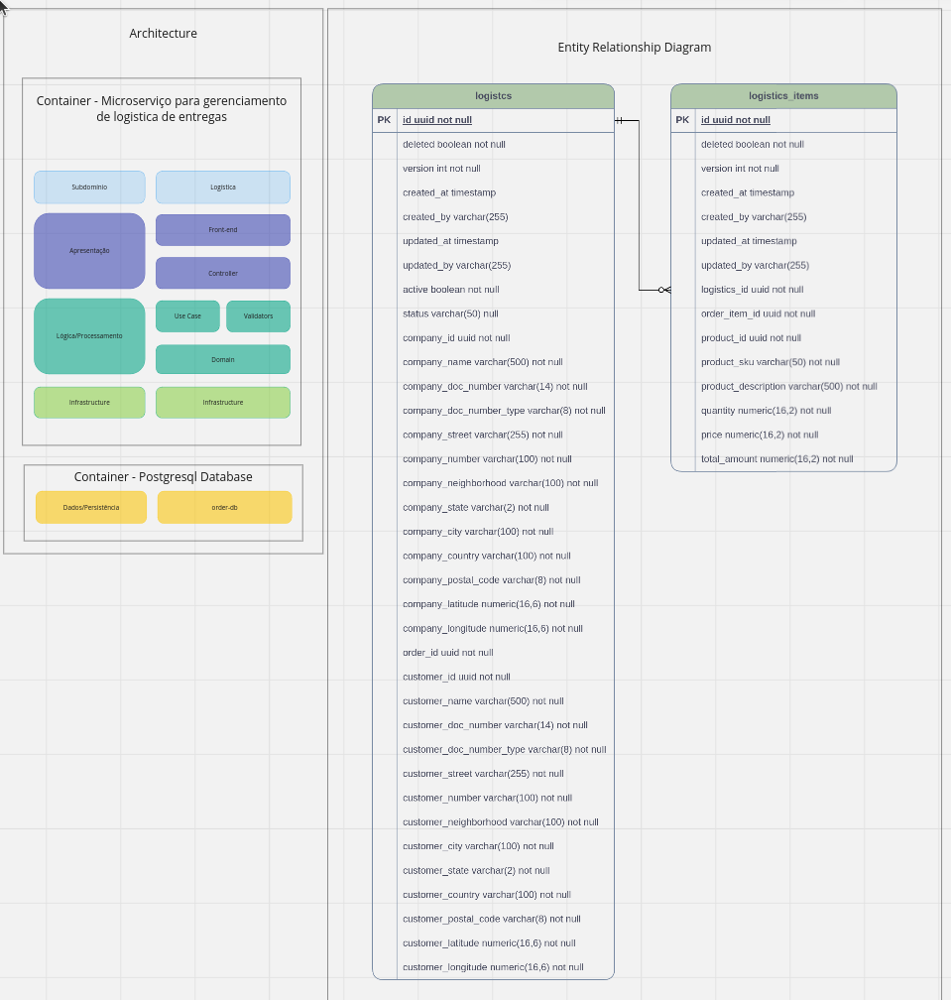
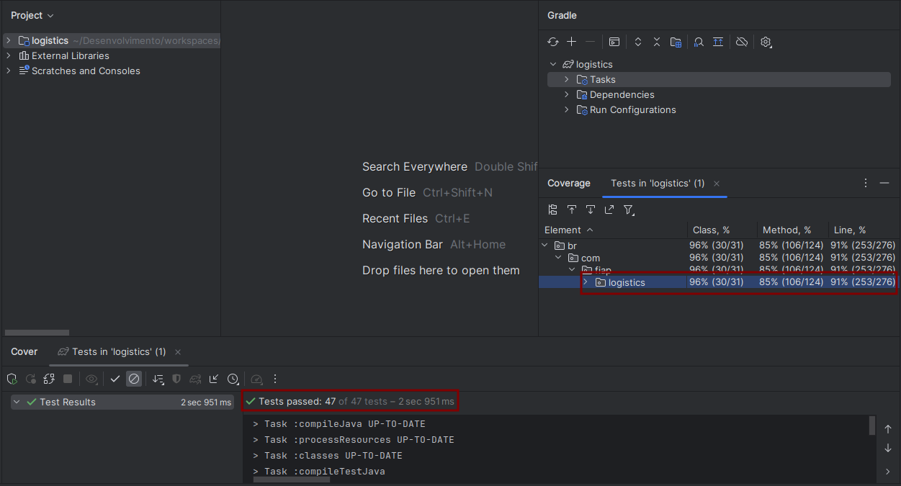
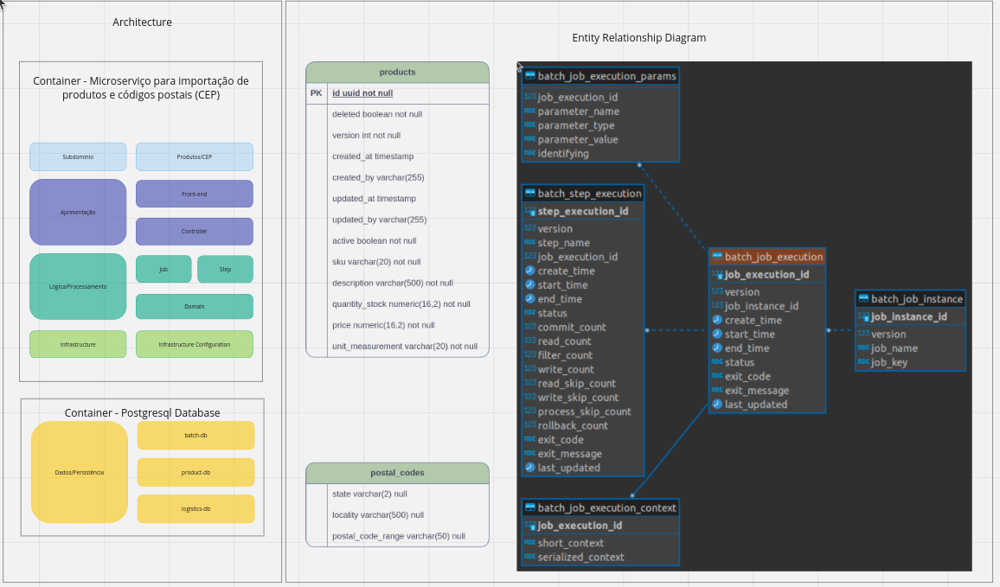

# Pós-Tech-FIAP/ALURA-Fase05

# Descrição do projeto
Criar um sistema de e-commerce, composto por microserviços de gestão de usuários, clientes, produtos e pedidos. O sistema será desenvolvido utilizando Java, Spring Boot, Spring Data JPA, Spring Open Feign e Spring Batch, Spring Security, Spring Doc Open Api, entre outros.

## Requisitos:
1. Microsserviço de gerenciamento de usuários: microsserviço responsável por todas as operações relacionadas aos usuários do sistema, incluindo a criação, leitura, atualização e exclusão de registros (CRUD).
2. Microsserviço de gerenciamento de empresa: microsserviço responsável por todas as operações relacionadas as empresas que serão fornecedoras de produtos, incluindo a criação, leitura, atualização e exclusão de registros (CRUD).
3. Microsserviço de gerenciamento de clientes: microsserviço responsável por todas as operações relacionadas aos clientes que comprarão algum produto, incluindo a criação, leitura, atualização e exclusão de registros (CRUD).
4. Microsserviço de catálogo de produtos: microsserviço responsável por todas as operações relacionadas aos produtos que serão consumidos por algum cliente, incluindo a criação, leitura, atualização e exclusão de registros (CRUD), com preço unitário.
5. Microsserviço de gestão de pedidos: centralizará o processamento de todos os pedidos de clientes que consumirão produtos, desde a criação, até a conclusão, incluindo o recebimento, e pagamento.

## Entregáveis:
1. Link do Github com o código fonte dos serviços desenvolvidos.
2. Documentação técnica.
3. Um relatório técnico descrevendo as tecnologias e ferramentas utilizadas, os desafios encontrados durante o desenvolvimento e as soluções implementadas para resolvê-las.

# Tecnologias utilizadas
1. Java 17
2. Gradle 7.6
3. Spring Boot 3.2.2
4. Spring Web MVC (compatível com o Spring Boot) 
5. Spring Data JPA (compatível com o Spring Boot)  
6. Spring Bean Validation (compatível com o Spring Boot) 
7. Spring Doc Open API 2.3.0
8. Spring Batch 5
9. Spring Open Feign 4.1.1
10. Lombok 
11. Postgres 15.1 e Postgres 16.3
12. Flyway 
13. JUnit 5
14. Mockito
15. TestContainers
16. Docker
17. WireMock 3.3.1

# Setup do Projeto

Para realizar o setup do projeto é necessário possuir o Java 17, Gradle 7.6, docker 24 e docker-compose 1.29 instalado em sua máquina.
Faca o download do projeto (https://github.com/EvolutionTeamFiapAluraPostech/fiapAluraTechChallengeFase04-microservicos) e atualize suas dependências com o gradle.
Antes de iniciar o projeto é necessário criar o banco de dados. O banco de dados está programado para ser criado em um container. 
Para criar o container, execute o docker-compose (Acesse a pasta raiz do projeto, no mesmo local onde encontra-se o arquivo compose.yaml). Para executá-lo, execute o comando docker-compose up -d (para rodar detached e não prender o terminal). O docker compose irá criar os bancos de dados, buildar a imagem de cada um dos microsserviços, iniciar a aplicação dentro do container correspondente (em sua porta específica). Desta maneira, o conjunto todo da solução estará disponível para ser consumido.
Após a inicialização dos microsserviços, será necessário se autenticar, pois o Spring Security está habilitado. Para tanto, utilize o Postman (ou outra aplicação de sua preferência), crie um endpoint para realizar a autenticação, com a seguinte url **localhost:8080/authenticate**. No body, inclua um json contendo o atributo “email” com o valor “thomas.anderson@itcompany.com” e outro atributo “password” com o valor “@Bcd1234”. Realize a requisição para este endpoint para se obter o token JWT que deverá ser utilizado para consumir os demais endpoints do projeto.
Segue abaixo instruções do endpoint para se autenticar na aplicação.

POST /authenticate HTTP/1.1
Host: localhost:8080
Content-Type: application/json
Content-Length: 76

{
"email": "thomas.anderson@itcompany.com",
"password": "@Bcd1234"
}

# Collection do Postman
* Marcelo-RM350802-Fiap-Alura-Tech Challenge-Fase05.postman_collection.json
* Esta collection está salva na raiz do projeto.

# Environments do Postman
* Marcelo-RM350802-Fiap-Alura-Tech Challenge-Fase05.postman_dev_environment.json
* Estas environments estão salvas na raiz do projeto.

# Documentação da API
* Local dev
  * Microsserviço de Gerenciamento de usuários - http://localhost:8080/swagger-ui/index.html
  * Microsserviço de Gerenciamento de empresas - http://localhost:8081/swagger-ui/index.html
  * Microsserviço de Gerenciamento de clientes - http://localhost:8082/swagger-ui/index.html
  * Microsserviço de Gerenciamento de produtos - http://localhost:8083/swagger-ui/index.html
  * Microsserviço de Gerenciamento de pedidos - http://localhost:8084/swagger-ui/index.html

# Documentação do PROJETO
O projeto está dividido em 6 containers de microsserviços backend Java Spring Boot e outros 5 containers de banco de dados Postgresql. Cada um dos microsserviços possui seu respectivo banco de dados.

O backend foi implementado seguindo as recomendações da Clean Architecture, com Clean Code, SOLID e testes automatizados (de unidade e integração), seguindo os princípios do FIRST e Clean Tests. Observação: a Clean Architecuture não foi completamente implementada, visto que os microsserviços são fortemente acomplados com o Spring, entretanto, a aplicação está bem segmentada em pacotes, classes e responsabilidades, seguindo os princípios do DDD.

# Microsserviço de gerenciamento de usuários
O objetivo deste microsserviço é gerenciar os usuários do sistema, ou seja, os consumidores de produtos que realizarão pedidos de compra de algum produto no e-commerce.
  * Microsserviço de gerenciamento de usuários
    * API: 
        * http://localhost:8080/users 
            * Verbo POST - para realizar o cadastro.
                * Escopo: público, não requer autenticação.
                * Regras de negócio:
                    * Atributos name, email e password obrigatórios;
                    * Atributos name e email com o tamanho máximo de 500 caracteres;
                    * Atributo senha com o tamanho mínimo de 8 e máximo de 20 caracteres;
                    * Validação de força da senha, exigindo no mínimo 1 caracter maiúsculo, 1 caracter minúsculo, 1 caracter              especial ( @#$%^&+= ) e 1 número;
                    * Validação do e-mail único na base de dados;
                    * O atributo password será criptografado antes de ser 
                    armazenado no banco de dados.
                * Http response status do endpoint:
                    * Status 201 - Created - cadastro realizado com input de dados válidos;
                    * Status 400 - Bad request - se alguma regra foi violada;
                    * Status 409 - Conflict - se o e-mail ou cpf do usuário já está cadastrado na base de dados.

        * http://localhost:8080/users/{id} 
            * Verbo GET - para realizar a pesquisa de um usuário pelo seu ID.
                * Escopo: privado, requer autenticação.
                * Regras de negócio:
                    * O usuário será pesquisado por um UUID válido.
                    * O usuário já deve ter sido cadastrado anteriormente;
                * Http response status do endpoint:
                    * Status 200 - Ok - se o usuário foi encontrado por seu ID;
                    * Status 400 - Bad request - se alguma regra foi violada;
                    * Status 404 - Not found - se o usuário não foi encontrado por seu ID;
                    * Status 409 - Conflict - se o e-mail ou cpf do usuário já está cadastrado na base de dados.

            * Verbo PUT - para realizar a atualização de dados de um usuário pelo seu ID. Necessário informar request body.
                * Escopo: privado, requer autenticação.
                * Regras de negócio:
                    * O usuário será pesquisado por um UUID válido;
                    * O usuário já deve ter sido cadastrado anteriormente;
                    * O email/cpf não pode ser atualizado no usuário se já estiverem sendo utilizados por outro usuário;
                    * Demais regras equivalentes para realizar o cadastro.
                * Http response status do endpoint:
                    * Status 202 - Accepted - atualização realizada com input de dados válidos;
                    * Status 400 - Bad request - se alguma regra foi violada;
                    * Status 404 - Not found - se o usuário não foi encontrado por seu ID para ser atualizado;
                    * Status 409 - Conflict - se o e-mail ou cpf do usuário já está cadastrado na base de dados.

            * Verbo DELETE - para realizar a exclusão (soft delete) de um usuário pelo seu ID.
                * Escopo: privado, requer autenticação.
                * Regras de negócio:
                    * O usuário será pesquisado por um UUID válido.
                    * O usuário já deve ter sido cadastrado anteriormente;
                * Http response status do endpoint:
                    * Status 204 - No content - exclusão realizada com sucesso;
                    * Status 400 - Bad request - se alguma regra foi violada;
                    * Status 404 - Not found - se o usuário não foi encontrado por seu ID para ser excluído;

        * http://localhost:8080/users/name-email
            * Verbo GET - para realizar a pesquisa paginada de um usuário pelo seu nome ou email.
                * Escopo: privado, requer autenticação.
                * Regras de negócio:
                    * O usuário será pesquisado por um e-mail com formato válido.
                    * O usuário já deve ter sido cadastrado anteriormente;
                * Http response status do endpoint:
                    * Status 200 - Ok - usuário encontrado com sucesso;
                    * Status 200 - Ok - usuário não encontrado, mas com response body com propriedades de paginação, porém com o content vazio;
                    * Status 400 - Bad request - se alguma regra foi violada;

    * Documentação da API: http://localhost:8080/swagger-ui/index.html
    * Banco de dados: http://localhost:5432/users-db

    

    Testes de integração e unidade com 93% de linhas de código cobertas.

    

# Microsserviço de gerenciamento de empresas
O objetivo deste microsserviço é gerenciar as empresas fornecedoras de um produto ou serviço para atender seus clientes. A empresa cadastrada será o ponto inicial da rota de entrega do bem para o cliente.
  * Microsserviço de Gerenciamento de empresas 
    * API: 
        * http://localhost:8082/companies 
            * Verbo POST - para realizar o cadastro.
        * http://localhost:8082/companies/{id} 
            * Verbo GET - para realizar a pesquisa de uma empresa pelo seu ID.
            * Verbo PUT - para realizar a atualização de dados de uma empresa pelo seu ID. Necessário informar request body.
            * Verbo DELETE - para realizar a exclusão (soft delete) de uma empresa pelo seu ID.
        * http://localhost:8082/companies/name-email
            * Verbo GET - para realizar a pesquisa paginada de uma empresa pelo seu nome ou email.
    * Documentação da API: http://localhost:8082/swagger-ui/index.html
    * Banco de dados: http://localhost:5432/company-db

    

    Testes de integração e unidade com 93% de linhas de código cobertas.

    

# Microsserviço de gerenciamento de clientes
O objetivo deste microsserviço é gerenciar os clientes consumidores de produto/serviço das empreasas fornecedoras. O cliente cadastrado será o ponto final da rota de entrega do bem para o cliente.
  * Microsserviço de Gerenciamento de clientes 
    * API: 
        * http://localhost:8083/customers
            * Verbo POST - para realizar o cadastro.
        * http://localhost:8083/customers/{id}
            * Verbo GET - para realizar a pesquisa de um cliente pelo seu ID.
            * Verbo PUT - para realizar a atualização de dados de um cliente pelo seu ID. Necessário informar request body.
            * Verbo DELETE - para realizar a exclusão (soft delete) de um cliente pelo seu ID.   
        * http://localhost:8083/customers/name-email
            * Verbo GET - para realizar a pesquisa paginada de um cliente pelo seu nome ou email.             
    * Documentação: http://localhost:8083/swagger-ui/index.html
    * Banco de dados: http://localhost:5433/customer-db

    

    Testes de integração e unidade com 93% de linhas de código cobertas.

    

# Microsserviço de gerenciamento de produtos
O objetivo deste microsserviço é gerenciar os produtos/serviços cadastrados pelo fornecedor, que por sua vez, serão incluídos em pedidos de venda.
  * Microsserviço de Gerenciamento de produtos 
    * API: 
        * http://localhost:8084/products
            * Verbo POST - para realizar o cadastro.
        * http://localhost:8084/products/{id}
            * Verbo GET - para realizar a pesquisa de um produto pelo seu ID.
            * Verbo PUT - para realizar a atualização de dados de um produto pelo seu ID. Necessário informar request body.
            * Verbo DELETE - para realizar a exclusão (soft delete) de um produto pelo seu ID.   
        * http://localhost:8084/products/sku-description
            * Verbo GET - para realizar a pesquisa paginada de um produto pelo seu sku ou descrição.
    * Documentação: http://localhost:8084/swagger-ui/index.html
    * Banco de dados: http://localhost:5434/product-db

    

    Testes de integração e unidade com 92% de linhas de código cobertas.

    

# Microsserviço de gerenciamento de pedidos
O objetivo deste microsserviço é gerenciar os pedidos cadastrados pelos clientes, que irão consumir um produto/serviço.
  * Microsserviço de Gerenciamento de pedidos 
    * API: 
        * http://localhost:8085/orders
            * Verbo POST - para realizar o cadastro.
        * http://localhost:8085/orders/{id}
            * Verbo GET - para realizar a pesquisa de um pedido pelo seu ID.
            * Verbo PUT - para realizar a atualização de dados de um pedido pelo seu ID. Necessário informar request body.
            * Verbo DELETE - para realizar a exclusão (soft delete) de um pedido pelo seu ID.   
        * http://localhost:8085/orders/{id}/payment-confirmation
            * Verbo PATCH - para informar o pagamento do pedido. Este endpoint realiza uma comunicação com o endpoint do microsserviço de logística/entrega para cadastrar uma ordem de entrega. Neste endpoint será validado se o pedido já foi pago e evitar duplicidade de pagamento.
        * http://localhost:8085/orders/{id}/awaiting-delivery
            * Verbo PATCH - para informar que o pedido está em entrega. Este endpoint será consumido pelo microsserviço de logística/entrega quando o pedido estiver em rota de entrega. Neste endpoint será validado se o pedido foi pago e se já está no status atual, evitando persistência desnecessária no banco de dados.
        * http://localhost:8085/orders/{id}/delivery-confirmation
            * Verbo PUT - para informar que o pedido foi entregue. Este endpoint será consumido pelo microsserviço de logística/entrega quando a entrega do pedido for concluída. Neste endpoint será validado se o pedido foi pago e se já está no status atual, evitando persistência desnecessária no banco de dados.
        * http://localhost:8085/orders/company-customer
            * Verbo GET - para realizar a pesquisa paginada de um pedido pela empresa ou cliente.        
    * Documentação: http://localhost:8085/swagger-ui/index.html
    * Banco de dados: http://localhost:5435/order-db

Testes de integração e unidade com 85% de linhas de código cobertas.

# Microsserviço de gerenciamento de logística/entrega
O objetivo deste microsserviço é gerenciar a logística e entrega dos pedidos cadastrados e pagos pelos clientes.
  * Microsserviço de Gerenciamento de entregas/logística 
    * API: 
        * http://localhost:8086/logistics
            * Verbo POST - para realizar o cadastro da ordem de entrega, que será gerado no pagamento do pedido. Este endpoint será consumido pelo microserviço de pedidos, no momento do pagamento do pedido.
        * http://localhost:8086/logistics/{id}
            * Verbo GET - para realizar a pesquisa de uma ordem de entrega pelo seu ID.            
        * http://localhost:8086/logistics/order-id/{id}
            * Verbo GET - para realizar a pesquisa de uma ordem de entrega pelo ID do pedido de venda.            
        * http://localhost:8086/logistics/{id}/order-is-ready-to-deliver
            * Verbo PATCH - para realizar confirmação que o pedido está pronto para ser entregue, após a análise da rota de entrega. Este endpoint consumirá o microsserviço de pedido quando o pedido estiver em rota de entrega. Neste endpoint será validado se o pedido já foi entregue e se já está no status atual, evitando persistência desnecessária no banco de dados.
        * http://localhost:8086/logistics/{id}/delivery-confirmation
            * Verbo PATCH - para realizar confirmação da entrega do pedido. Este endpoint consumirá o microsserviço de pedido quando o pedido for entregue. Neste endpoint será validado se o pedido foi entregue e se já está no status atual, evitando persistência desnecessária no banco de dados.
    * Documentação: http://localhost:8086/swagger-ui/index.html
    * Banco de dados: http://localhost:5436/logistics-db

    

    Testes de integração e unidade com 91% de linhas de código cobertas.

    

# Microsserviço de gerenciamento de importação de dados
O objetivo deste microsserviço é importar dados de produtos e CEPs de fontes externas de dados, como arquivo CSV.
  * Microsserviço de Gerenciamento de importação de dados 
    * API: 
        * http://localhost:8087/products/batch
            * Verbo POST - para realizar a importação de produtos para a base de dados do microsserviço de gerenciamento de produtos.
        * http://localhost:8087/logistics/batch
            * Verbo POST - para realizar a importação de CEPs para a base de dados do microsserviço de gerenciamento logística/entrega.
    * Documentação: http://localhost:8087/swagger-ui/index.html
    * Banco de dados: http://localhost:5437/batch-db
        * Este microsserviço possui seu próprio banco de dados para realizar o gerenciamento de importações realizadas (DER com o fundo escuro no print abaixo). 

    

# Qualidade de software
Para garantir a qualidade de software, implementamos testes de unidade e de integração na grande maioria do código. Para identificar o que foi testado, utilizamos a cobertura de testes de código do próprio IntelliJ IDEA. A decisão de utilizar o próprio IntelliJ foi motivada pela manutenção de menor número de dependências a serem adicionadas no projeto, com o objetivo de reduzir possibilidades de libs externas abrirem uma fragilidade na segurança da aplicação (lembrando do caso do Log4J) e que no cenário em que o projeto foi desenvolvido não foi necessária a adição do Jacoco.
Os testes de unidade foram implementados nas classes de domínio e application testando a menor unidade de código. Os testes de integração foram implementados nas classes de presentation, realizando a requisição REST aos endpoints em diversos cenários, testando o código por completo, da entrada dos dados, processamento e saída. O objetivo desta segregação foi considerar a eficiência dos testes versus o tempo de
entrega do projeto. Aplicando este método, foi apurado pela cobertuda de testes do IntelliJ IDEA, em mais de 90% de linhas de código testadas na maioria dos microserviços. Para realizar o teste de cobertura, clique com o botão direito do mouse sobre o nome do projeto, navegue até a opção More Run/Debug, em seguida selecione a opção Run tests in <nome do projeto> with Coverage.

