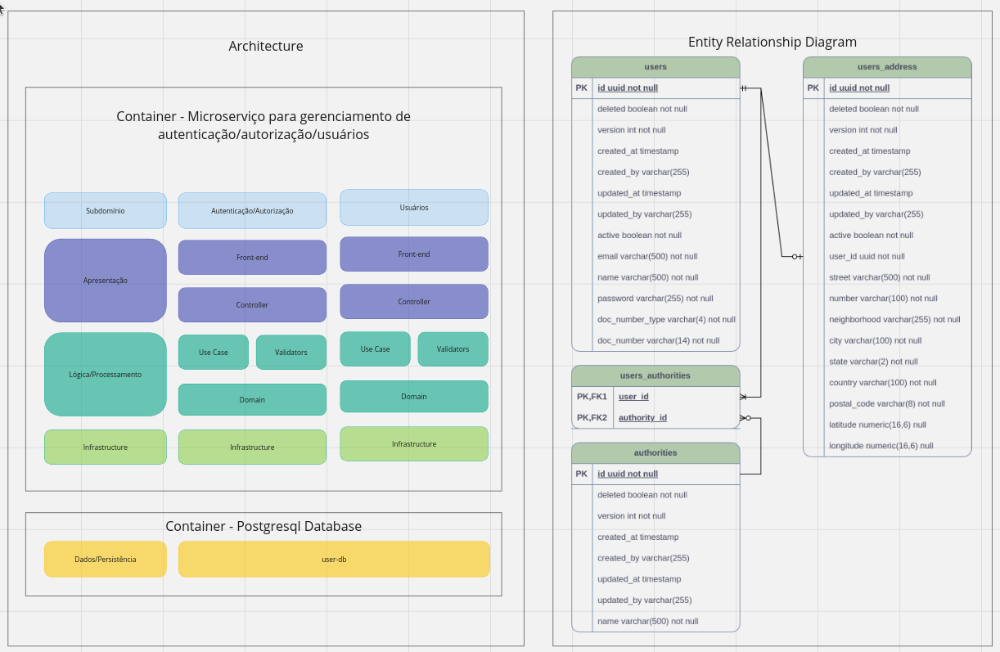

# Pós-Tech-FIAP/ALURA-Fase05

# Descrição do projeto
Criar um sistema de e-commerce, composto por microserviços de gestão de usuários, empresas, produtos e pedidos. O sistema será desenvolvido utilizando Java, Spring Boot, Spring Data JPA, Spring Open Feign e Spring Batch, Spring Security, Spring Doc Open Api, entre outros.

## Requisitos:
1. Microsserviço de gerenciamento de usuários: microsserviço responsável por todas as operações relacionadas aos usuários do sistema, incluindo a criação, leitura, atualização e exclusão de registros (CRUD), autenticação e autorização.

## Entregáveis:
1. Link do Github com o código fonte dos serviços desenvolvidos.
2. Documentação técnica.
3. Um relatório técnico descrevendo as tecnologias e ferramentas utilizadas, os desafios encontrados durante o desenvolvimento e as soluções implementadas para resolvê-las.

# Tecnologias utilizadas
1. Java 17
2. Gradle 7.6
3. Spring Boot 3.2.2
4. Spring Web MVC (compatível com o Spring Boot)
5. Spring Data JPA (compatível com o Spring Boot)
6. Spring Bean Validation (compatível com o Spring Boot)
7. Spring Doc Open API 2.3.0
8. Spring Batch 5
9. Spring Open Feign 4.1.1
10. Lombok
11. Postgres 15.1 e Postgres 16.3
12. Flyway
13. JUnit 5
14. Mockito
15. TestContainers
16. Docker
17. WireMock 3.3.1

# Setup do Projeto

Para realizar o setup do projeto é necessário possuir o Java 17, Gradle 7.6, docker 24 e docker-compose 1.29 instalado em sua máquina.
Faca o download do projeto (https://github.com/EvolutionTeamFiapAluraPostech/fiapAluraTechChallengeFase05-microservicos) e atualize suas dependências com o gradle.
Antes de iniciar o projeto é necessário criar o banco de dados. O banco de dados está programado para ser criado em um container.
Para criar o container, execute o docker-compose (Acesse a pasta raiz do projeto, no mesmo local onde encontra-se o arquivo compose.yaml). Para executá-lo, execute o comando docker-compose up -d (para rodar detached e não prender o terminal). O docker compose irá criar os bancos de dados, buildar a imagem de cada um dos microsserviços, iniciar a aplicação dentro do container correspondente (em sua porta específica). Desta maneira, o conjunto todo da solução estará disponível para ser consumido.
Após a inicialização dos microsserviços, será necessário se autenticar, pois o Spring Security está habilitado. Para tanto, utilize o Postman (ou outra aplicação de sua preferência), crie um endpoint para realizar a autenticação, com a seguinte url **localhost:8080/authenticate**. No body, inclua um json contendo o atributo “email” com o valor “thomas.anderson@itcompany.com” e outro atributo “password” com o valor “@Bcd1234”. Realize a requisição para este endpoint para se obter o token JWT que deverá ser utilizado para consumir os demais endpoints do projeto.
Segue abaixo instruções do endpoint para se autenticar na aplicação.

POST /authenticate HTTP/1.1
Host: localhost:8080
Content-Type: application/json
Content-Length: 76

{
"email": "thomas.anderson@itcompany.com",
"password": "@Bcd1234"
}

# Collection do Postman
* Marcelo-RM350802-Fiap-Alura-Tech Challenge-Fase05.postman_collection.json
* Esta collection está salva na raiz do projeto.

# Environments do Postman
* Marcelo-RM350802-Fiap-Alura-Tech Challenge-Fase05.postman_dev_environment.json
* Estas environments estão salvas na raiz do projeto.

# Documentação da API
* Local dev
    * Microsserviço de Gerenciamento de usuários - http://localhost:8080/swagger-ui/index.html

# Documentação do PROJETO
O projeto está dividido em 4 containers de microsserviços backend Java Spring Boot e outros 4 containers de banco de dados Postgresql. Cada um dos microsserviços possui seu respectivo banco de dados.

O backend foi implementado seguindo as recomendações da Clean Architecture, com Clean Code, SOLID e testes automatizados (de unidade e integração), seguindo os princípios do FIRST e Clean Tests. Observação: a Clean Architecuture não foi completamente implementada, visto que os microsserviços são fortemente acomplados com o Spring, entretanto, a aplicação está bem segmentada em pacotes, classes e responsabilidades, seguindo os princípios do DDD.

# Microsserviço de gerenciamento de usuários e autenticação na aplicação
O objetivo deste microsserviço é gerenciar os usuários do sistema, ou seja, os consumidores de produtos que realizarão pedidos de compra de algum produto no e-commerce.
* Microsserviço de gerenciamento de usuários
    * API:
        * http://localhost:8080/users
            * Verbo POST - para realizar o cadastro.
                * Escopo: público, não requer autenticação.
                * Regras de negócio:
                    * Atributos name, email e password obrigatórios;
                    * Atributos name e email com o tamanho máximo de 500 caracteres;
                    * Atributo senha com o tamanho mínimo de 8 e máximo de 20 caracteres;
                    * Validação de força da senha, exigindo no mínimo 1 caracter maiúsculo, 1 caracter minúsculo, 1 caracter especial ( @#$%^&+= ) e 1 número;
                    * Validação do e-mail único na base de dados;
                    * O atributo password será criptografado antes de ser
                      armazenado no banco de dados.
                * Http response status do endpoint:
                    * Status 201 - Created - cadastro realizado com input de dados válidos;
                    * Status 400 - Bad request - se alguma regra foi violada;
                    * Status 409 - Conflict - se o e-mail ou cpf do usuário já está cadastrado na base de dados.

        * http://localhost:8080/authenticate
            * Verbo POST - para realizar o login na aplicação com um usuário já cadastrado.
                * Escopo: público, não requer autenticação.
                * Regras de negócio:
                    * Atributos email e password obrigatórios;
                    * Atributo senha com o tamanho mínimo de 8 e máximo de 20 caracteres;
                    * Validação de força da senha, exigindo no mínimo 1 caracter maiúsculo, 1 caracter minúsculo, 1 caracter especial ( @#$%^&+= ) e 1 número;
                    * Validação do e-mail já cadastrado na base de dados;
                * Http response status do endpoint:
                    * Status 200 - Ok - usuário autenticado na aplicação;
                    * Status 400 - Bad request - se alguma regra foi violada;

        * http://localhost:8080/users/{id}
            * Verbo GET - para realizar a pesquisa de um usuário pelo seu ID.
                * Escopo: privado, requer autenticação.
                * Regras de negócio:
                    * O usuário será pesquisado por um UUID válido.
                    * O usuário já deve ter sido cadastrado anteriormente;
                * Http response status do endpoint:
                    * Status 200 - Ok - se o usuário foi encontrado por seu ID;
                    * Status 400 - Bad request - se alguma regra foi violada;
                    * Status 404 - Not found - se o usuário não foi encontrado por seu ID;

            * Verbo PUT - para realizar a atualização de dados de um usuário pelo seu ID. Necessário informar request body.
                * Escopo: privado, requer autenticação.
                * Regras de negócio:
                    * O usuário será pesquisado por um UUID válido;
                    * O usuário já deve ter sido cadastrado anteriormente;
                    * O email/cpf não pode ser atualizado no usuário se já estiverem sendo utilizados por outro usuário;
                    * Demais regras equivalentes para realizar o cadastro.
                * Http response status do endpoint:
                    * Status 202 - Accepted - atualização realizada com input de dados válidos;
                    * Status 400 - Bad request - se alguma regra foi violada;
                    * Status 404 - Not found - se o usuário não foi encontrado por seu ID para ser atualizado;
                    * Status 409 - Conflict - se o e-mail ou cpf do usuário já está cadastrado na base de dados.

            * Verbo DELETE - para realizar a exclusão (soft delete) de um usuário pelo seu ID.
                * Escopo: privado, requer autenticação.
                * Regras de negócio:
                    * O usuário será pesquisado por um UUID válido.
                    * O usuário já deve ter sido cadastrado anteriormente;
                * Http response status do endpoint:
                    * Status 204 - No content - exclusão realizada com sucesso;
                    * Status 400 - Bad request - se alguma regra foi violada;
                    * Status 404 - Not found - se o usuário não foi encontrado por seu ID para ser excluído;

        * http://localhost:8080/users/name-email
            * Verbo GET - para realizar a pesquisa paginada de um usuário pelo seu nome ou email.
                * Escopo: privado, requer autenticação.
                * Regras de negócio:
                    * O usuário será pesquisado por um e-mail com formato válido.
                    * O usuário já deve ter sido cadastrado anteriormente;
                * Http response status do endpoint:
                    * Status 200 - Ok - usuário encontrado com sucesso;
                    * Status 200 - Ok - usuário não encontrado, mas com response body com propriedades de paginação, porém com o content vazio;
                    * Status 400 - Bad request - se alguma regra foi violada;

    * Documentação da API: http://localhost:8080/swagger-ui/index.html
    * Banco de dados: http://localhost:5432/users-db

    

    Testes de integração e unidade com 93% de linhas de código cobertas.

    
